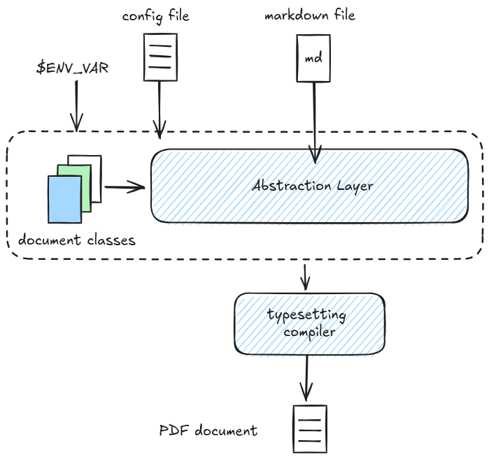
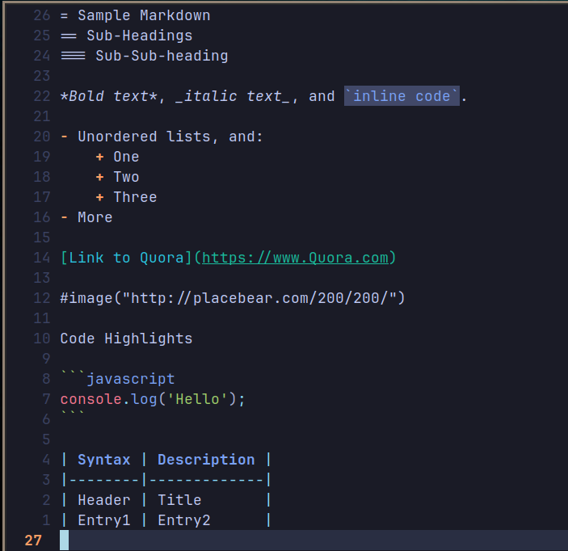
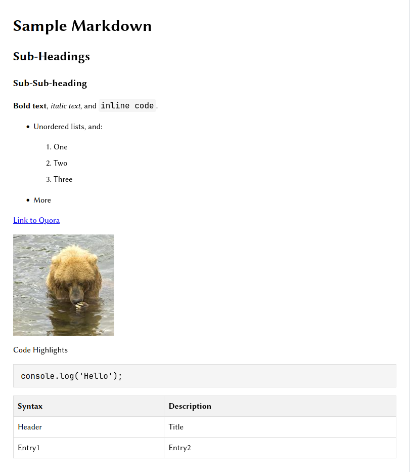
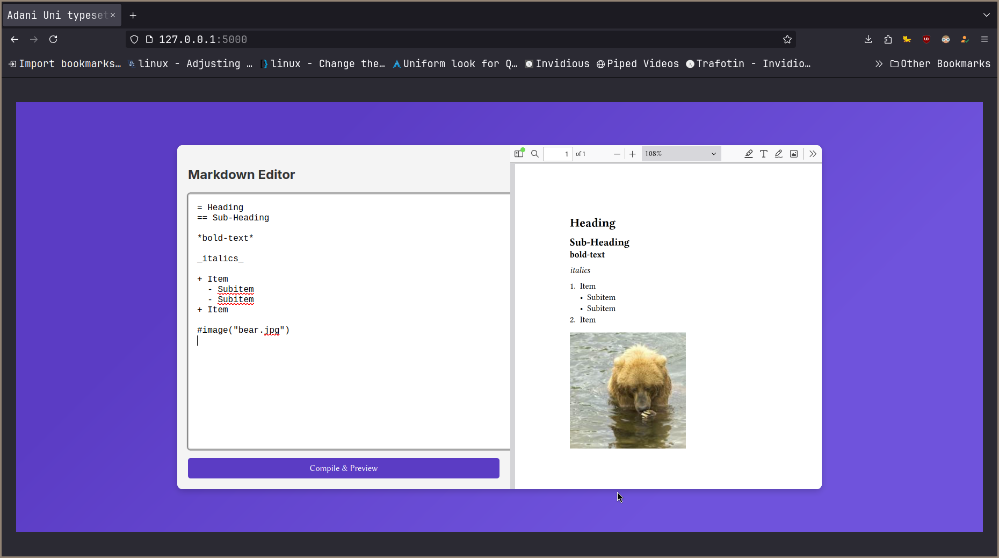
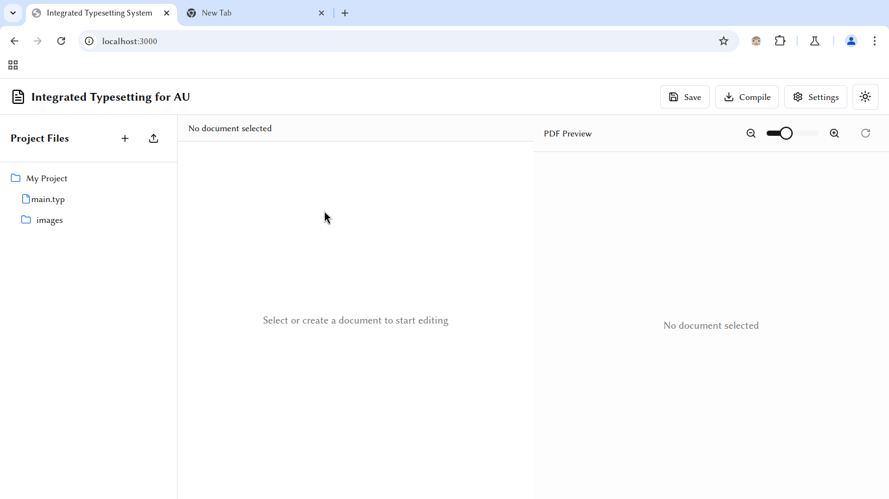

# Gendox

A lab report preparation solution for university coursework

## Architecture

## Input - Output

## Prototype

## UI Mockup

## Proposed Solution
- Specialized utilization of typesetting system
- Predefined template for each lab practicals
- Text file as input (markdown)
- PDF file as output
- Visual editor for extra customization.
- Screenshot automation, Snippets, etc.
- AI integration (Extra) Using API
- Can be used with text editors (Vim, VS Code, Sublime Text, etc.)
